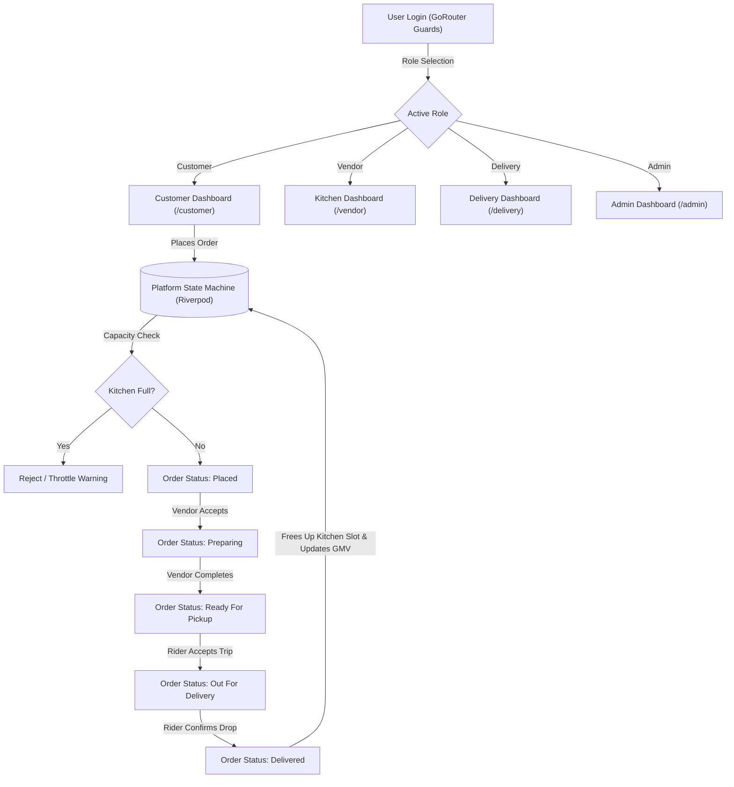

# CloudKitchen OS — Multi-Vendor Cloud Kitchen Platform
**B.Tech CSE / AI (Semester V) Case Study Project**  
**Industry:** FoodTech & Cloud Kitchen Logistics  
**Architecture:** Cross-Platform Flutter + Riverpod Reactive State Machine (In-Memory RBAC)  
**Design System:** Swiggy-Inspired Light Modern Theme (`#FC8019` Tangerine Orange, Slate Typography, Clean Elevation)

---

## 🌟 Executive Overview
**CloudKitchen OS** is an enterprise-grade FoodTech mobile and web ecosystem connecting four core actors:
1. **Customers** (Food discovery, customization, cart pricing engine, live order tracking)
2. **Kitchen Pods / Vendors** (Order Kanban, dynamic capacity throttle, inventory toggles)
3. **Delivery Partners** (Duty toggle, live dispatch radar, 5-stage trip progression stepper)
4. **Platform Administrators** (Financial analytics, Gross Merchandise Value [GMV], commissions, vendor take-rate controls)

The platform runs on a **self-contained reactive state engine** powered by **Riverpod 2.x/3.x** and **GoRouter** with route-guard middleware. It requires zero cloud credentials or Firebase CLI setup, making it 100% portable for evaluation on Chrome, macOS, Android, or iOS.

---

## 🚀 Key Feature Matrix Across 4 User Roles

### 1. 🛍️ Customer Dashboard (`/customer`)
- **Kitchen Discovery & Distance Filter:** 6 real-world cloud kitchen brands with live distance, prep time, and calculated Estimated Delivery Time (EDT).
- **Cuisine Filter Chips:** Instant single-tap filtering (*Biryani*, *Healthy*, *Pan-Asian*, *South Indian*, *Italian*, *Rolls*, *Continental*).
- **Live Kitchen Throttle Indicator:** Real-time capacity badge (*Active*, *Peak Capacity*, or *Paused*).
- **Dish Customization & Cart Sheet:** Deep modal sheet supporting portion sizes and add-ons.
- **Dynamic Pricing Engine:** Item subtotal, per-km delivery fee, ₹5 static platform fee, and **Swiggy One membership 100% free delivery waivers**.
- **Live Order Tracking View:** 6-stage vertical progress stepper with rider contact card and countdown ETA.

### 2. 👨‍🍳 Kitchen (Vendor) Dashboard (`/vendor`)
- **Outlet Selector Dropdown:** Seamlessly switch between multiple cloud kitchen pods (e.g. *Nawabi Dum*, *Bowl & Green*, *Wok Samurai*, etc.).
- **Kitchen Capacity & Throttle Controller:** Interactive capacity stepper preventing kitchen overbooking by throttling incoming orders when slots are full.
- **Store Status Switch:** Instant **ONLINE** vs **PAUSED** switch to stop incoming orders during inventory shortage.
- **Live Orders Kanban:** Tabbed workflow categorizing orders into:
  - `Incoming (Placed)`: One-tap *Accept & Cook*
  - `Preparing`: One-tap *Mark Ready for Pickup*
  - `Dispatched`: Read-only queue of orders collected by riders
- **Menu & Inventory Stock Control:** Instant toggles for dish availability + modal to add new dishes with custom prep times.
- **⚡ Live Order Simulator:** Instant button to inject synthetic test orders into the live queue for demonstration.

### 3. 🛵 Delivery Partner (Rider) Dashboard (`/delivery`)
- **Duty Mode Switch:** Instant **DUTY ON** / **DUTY OFF** toggle to control order dispatch availability.
- **Today's Metric Summary:** Real-time metrics displaying completed trips, daily accumulated earnings (₹), and customer rating (4.9 ★).
- **Live Dispatch Radar:** Lists available unassigned orders with pickup kitchen, drop address, distance (km), and guaranteed rider payout (₹).
- **Active Mission Navigation Stepper:** Step-by-step state progression:
  1. *Assigned / Start Journey to Kitchen*
  2. *En Route to Kitchen / Arrived at Kitchen*
  3. *Order Picked Up / Start Delivery to Customer*
  4. *Confirm Delivery to Customer* (automatically marks order as delivered and frees up kitchen slot!).

### 4. 📊 Platform Admin Console (`/admin`)
- **Platform Financial Analytics:**
  - Gross Merchandise Value (GMV)
  - Platform Net Revenue (15%–30% vendor commissions + ₹5 platform fees)
  - Total orders placed across all locations
  - Real-time active kitchen count
- **Multi-Vendor Management:**
  - Interactive take-rate tiered selectors (15%, 20%, 25%, 30% commission rates)
  - Promoted / Sponsored listing slot toggles with visual badges
  - Real-time operational pod emergency shut-off switch
- **Financial Ledger & Audit Trail:** Detailed transaction ledger tracking customer spend, platform commission cut, and net vendor payout for every completed order.

---

## 🏛️ System Architecture & State Machine



### Key Technical Patterns
1. **Riverpod Global State Notifier (`PlatformNotifier`):**
   - Single source of truth containing reactive lists of `kitchens`, `menuItems`, `orders`, and `deliveryTasks`.
   - Modifying an order in the Vendor dashboard immediately updates the Customer's live tracker and the Admin ledger without page reloads.
2. **GoRouter Route-Based Middleware (`AppRouter`):**
   - Routes `/customer`, `/vendor`, `/delivery`, `/admin` are guarded by `AppRouter.redirect`.
   - Unauthorized navigation attempts automatically redirect to `/login`.
3. **Monetization Engine (`PricingCalculator`):**
   - Implements dynamic distance-based pricing: `deliveryFee = baseFee + (distanceKm * perKmRate)`.
   - Automatically waives delivery fees when `isPremiumMember == true` (Swiggy One).
   - Computes platform commission and net kitchen payout on each transaction.
4. **Unified Profile Modal (`UserProfileModal`):**
   - Single header avatar pill displaying user initials and current role.
   - Tap opens modal containing account details, Swiggy One subscription toggle, UID, and a 1-tap workspace role switcher for demonstration convenience.

---

## 📁 Directory Structure & File Map

```text
lib/
├── main.dart                                       # App entry point, ProviderScope, MaterialApp.router
├── core/
│   ├── router/app_router.dart                      # GoRouter config with role-based auth middleware
│   ├── theme/app_theme.dart                        # Authentic Swiggy light theme (Orange, Amber, Green)
│   └── utils/pricing_calculator.dart               # Pricing, commission & fee waiver mathematical engine
└── features/
    ├── auth/
    │   ├── domain/
    │   │   ├── app_user.dart                       # AppUser entity (UID, email, role, phone, membership)
    │   │   └── user_role.dart                      # UserRole enum (Customer, Vendor, Delivery, Admin)
    │   └── presentation/
    │       ├── auth_controller.dart                # Riverpod AuthController with pre-seeded demo accounts
    │       ├── login_screen.dart                   # Sign-in UI with 1-tap pre-fill test role pills
    │       └── profile_modal.dart                  # Slide-up modal for profile details & instant role switch
    ├── common_widgets/
    │   └── role_switch_header.dart                 # Responsive header with branding & unified profile pill
    ├── models/
    │   ├── kitchen.dart                            # Kitchen model with capacity & EDT formulas
    │   ├── menu_item.dart                          # Dish entity with customization groups
    │   ├── order_model.dart                        # Order state machine (6 status stages)
    │   └── delivery_task.dart                      # Delivery mission model with 5 routing stages
    ├── data/
    │   └── kitchen_repository.dart                 # Central reactive state engine & mock dataset (6 kitchens, 16 dishes, 5 orders)
    ├── customer/
    │   ├── cart/cart_provider.dart                 # Reactive shopping cart state
    │   └── presentation/
    │       ├── customer_dashboard.dart             # Discovery, search, cuisine chips & floating cart bar
    │       ├── kitchen_detail_view.dart            # Dish catalog & item customization sheets
    │       └── order_tracking_view.dart            # Live order route progression stepper
    ├── vendor/
    │   └── presentation/kitchen_dashboard.dart     # Kitchen capacity meter, Kanban board & menu management
    ├── delivery/
    │   └── presentation/delivery_dashboard.dart    # Rider duty switch, dispatch radar & trip stepper
    └── admin/
        └── presentation/admin_dashboard.dart       # GMV analytics, take-rate sliders & transaction audit ledger
```

---

## 🎓 Viva & Presentation Demo Script (Semester Evaluation)

1. **Authentication & RBAC Routing:**
   - On the `/login` screen, point out the pre-seeded role test accounts.
   - Tap any role (e.g. *Delivery Partner*), click **"Sign In to Dashboard"**, and show how GoRouter automatically redirects to `/delivery`.
2. **Unified Profile & Role Switcher:**
   - Tap the top-right `[ S Delivery Partner ▾ ]` avatar pill.
   - Show the slide-up modal with User UID, role-specific telemetry, and the live Swiggy One membership toggle.
3. **Capacity Throttle & Overbooking Prevention:**
   - Switch to **Kitchen Dashboard**. Select *Nawabi Dum Cloud Kitchen*.
   - Lower the capacity limit button so that active orders reach max capacity.
   - Switch to **Customer Dashboard** and observe the live badge change to *"Kitchen at Peak Capacity"*. Attempting to place an order shows an overbooking warning!
4. **End-to-End Order Lifecycle:**
   - As a Customer, place an order.
   - Switch to **Kitchen** to move the order from *Incoming* to *Preparing* and then *Ready for Pickup*.
   - Switch to **Delivery Partner** to accept the trip from the radar, advance stages (*En Route* ➔ *Picked Up* ➔ *Delivered*).
   - Switch to **Admin** to see the order in the financial transaction audit ledger with platform commission recorded!

